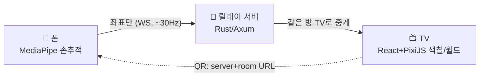

# AirCanvas Kids 🖐️📺

**스마트폰 카메라 1대 + 스마트 TV 1대 + Wi-Fi** 만으로 플레이하는 공중 제스처 드로잉·색칠 게임.

아이(또는 아이와 부모가 함께)가 TV 앞 허공에서 손가락으로 그림을 그리면,
폰 카메라가 **손 좌표만** 추적해 TV 화면의 커서를 움직입니다.
색칠을 완성하면 작품이 파티클 이펙트와 함께 **공룡 / 정글 / 바다** 테마 월드에 투입됩니다.

> 핵심 원칙: **카메라 영상은 어디로도 전송되지 않습니다.** 폰은 좌표(초당 수 KB)만 보내고,
> 모든 렌더링은 TV에서 일어납니다. 프라이버시 안전 + 초저지연 + 초저트래픽.

폰 연결은 **TV 화면의 QR 스캔 한 번**으로 끝납니다 — 서버 주소와 방 코드가 URL 파라미터로
전달되어 별도 입력 없이 바로 캘리브레이션으로 진입합니다.



## 저장소 구조

```
hand-tracking/
├─ apps/
│  ├─ phone/        # 폰 클라이언트: MediaPipe 손추적, 4점 호모그래피 캘리브레이션
│  └─ tv/           # TV 클라이언트: PixiJS 렌더링, 색칠 판정, QR 연결, 테마 월드 갤러리
├─ packages/
│  ├─ protocol/     # WS 메시지 스키마 단일 진실원 (@ht/protocol)
│  └─ tv-art/       # 아트워크 30종 데이터 (공룡·정글·바다 × 10) (@ht/tv-art)
├─ server/          # Rust(Axum) WebSocket 릴레이 — 방 코드 세션 매칭
├─ tools/           # 가짜 폰 시뮬레이터, 릴레이 스모크 테스트
└─ docs/            # 아키텍처/프로토콜/캘리브레이션/콘텐츠/로드맵 문서
```

## 빠른 시작 (Windows 개발 PC 기준)

### 0) 요구 사항

- Node.js 20+ / npm 10+
- Rust (Windows에서 MSVC Build Tools가 없다면 아래 [Rust 빌드 참고](#rust-빌드-참고-windows) 참조)
- 같은 Wi-Fi(또는 LAN)에 연결된 스마트폰과 스마트 TV

### 1) 설치 & 전체 빌드

```powershell
npm run setup      # 워크스페이스 설치 + 패키지 타입검사
npm run build      # TV/폰 앱 프로덕션 빌드
npm run server:check
```

### 2) 실행 (개발 모드, 터미널 3개)

```powershell
npm run server:run   # 터미널 1: 릴레이 서버 (:8080)
npm run dev:tv       # 터미널 2: TV 앱 (:5173) — TV 브라우저에서 http://<PC IP>:5173
npm run dev:phone    # 터미널 3: 폰 앱 (:5174) — 폰 브라우저용 (직접 접속할 일은 거의 없음)
```

플레이 흐름:

1. TV가 **QR 코드 + 방 코드 6자리** 표시 (홈 화면)
2. 폰 카메라로 **QR 스캔** → 서버 주소·방 코드 자동 입력, 자동 입장
   (QR 인식이 안 되면 폰 앱에서 방 코드 수동 입력도 가능)
3. **폰에서 테마(공룡/정글/바다)와 작품을 선택** → TV에 해당 그림이 로드됨
   (테마 선택 UI는 폰에만 있고, TV는 대기 화면만 보여준다)
4. 자동으로 **4코너 캘리브레이션**(TV 점을 카메라 십자에 맞춰 캡처 ×4) — 한 번만 하면 저장됨
5. 폰을 TV 앞(또는 살짝 옆)에 고정 → 아이가 허공에 손으로 그림
6. 폰에서 색/모드(색칠·그리기) 선택, **"이 위치 채우기"** 로 영역 색칠
7. 진행도 85% 달성 → 완성 이펙트 → 테마 월드 갤러리에 작품 등장

#### URL 파라미터 레퍼런스

| 앱 | 파라미터 | 설명 |
|---|---|---|
| TV (`:5173`) | `?server=http://IP:8080` | 릴레이 서버 주소 오버라이드 |
| TV | `?phoneApp=http://IP:5174` 또는 `?phonePort=5174` | QR에 넣을 폰 앱 주소 오버라이드 |
| 폰 (`:5174`) | `?server=http://IP:8080` | 릴레이 서버 주소 (QR로 자동 전달됨) |
| 폰 | `?room=ABC123` | 방 코드 자동 입력 + 자동 입장 (QR로 자동 전달됨) |

기본값: TV/폰 모두 같은 호스트의 `:8080` 서버를 사용한다고 가정하며,
폰 앱 주소는 TV 페이지의 호스트명 + 포트 5174 조합으로 자동 생성됩니다.

### 데모(폰 없이) 검증

PC에서 시뮬레이터로 좌표를 흘려보내 TV 커서가 도는 것을 확인할 수 있습니다:

```powershell
node tools/fake-phone-sim.mjs DEMO01   # TV 화면의 방 코드와 동일하게 입력
node tools/smoke-relay.mjs             # 서버 릴레이 자동 스모크 테스트
```

### Rust 빌드 참고 (Windows)

MSVC Build Tools가 없는 환경에서는 GNU 툴체인으로 빌드할 수 있습니다:

```powershell
rustup toolchain install stable-x86_64-pc-windows-gnu   # 셀프컨테인드 링커 포함
winget install BrechtSanders.WinLibs.POSIX.UCRT         # dlltool 내부에서 쓰는 as.exe 해결
$env:PATH = "$env:LOCALAPPDATA\Microsoft\WinGet\Packages\BrechtSanders.WinLibs.POSIX.UCRT_Microsoft.Winget.Source_8wekyb3d8bbwe\mingw64\bin;$env:PATH"
cargo +stable-x86_64-pc-windows-gnu build --manifest-path server/Cargo.toml
```

루트 `package.json` 의 `server:*` 스크립트에는 GNU 툴체인 지정이 이미 들어가 있습니다.

## 폰 카메라 권한 (중요)

브라우저는 **보안 컨텍스트(HTTPS 또는 localhost)** 에서만 카메라를 허용합니다.
LAN IP로 폰 앱을 여는 경우 다음 중 하나가 필요합니다:

- **가장 간단:** 크롬 주소창에 `chrome://flags/#unsafely-treat-insecure-origin-as-secure` →
  `http://<PC IP>:5174` 추가 후 재시작 (개발/가정용 한정)
- Vite 개발 서버에 HTTPS 프록시 추가 (`@vitejs/plugin-basic-ssl` 등) — M2 예정
- 배포 시 LAN 내 리버스 프록시(Caddy)로 인증서 구성

## 문서

| 문서 | 내용 |
|---|---|
| [docs/architecture.md](docs/architecture.md) | 시스템 구성요소, 데이터 흐름, Mermaid 다이어그램 |
| [docs/protocol.md](docs/protocol.md) | WebSocket 메시지 명세와 트래픽 예산 |
| [docs/calibration.md](docs/calibration.md) | 4코너 호모그래피 캘리브레이션 원리·절차·품질 기준 |
| [docs/content-pipeline.md](docs/content-pipeline.md) | 아트워크 30종 규격과 색칠 진행도 알고리즘 |
| [docs/roadmap.md](docs/roadmap.md) | M2~M4 계획 및 기술 부채 |
| [agents/rules.md](agents/rules.md) | 프로젝트 작업 규칙 |

## 기술 스택

- **TV:** React 18 · PixiJS 8 · qrcode(QR 생성) · Vite
- **Phone:** React 18 · MediaPipe Tasks Vision(Hand Landmarker, WASM/GPU) · One-Euro 필터 · Vite
- **Server:** Rust · Axum 0.8 · tokio-tungstenite
- **공유:** TypeScript 워크스페이스 모노레포, 좌표는 항상 0..1 정규화(TV 좌표계)

## 현재 상태 (v0.1 MVP)

- [x] 릴레이 서버: 방 코드 매칭, 좌표 중계 (스모크 테스트 통과)
- [x] 폰: MediaPipe 손 추적 → 호모그래피 변환 → One-Euro 스무딩 → 30Hz 전송
- [x] TV: 커서/자유선/영역 색칠, 진행도 집계, 완성 파티클, 테마 갤러리
- [x] 콘텐츠: 공룡·정글·바다 × 각 10종 = 30종
- [x] QR 스캔 연결(TV→폰 서버주소·방코드 자동 전달) + 수동 입력 폴백
- [x] **테마/작품 선택을 폰에서 수행** (`select-theme` / `select-artwork` 메시지)
- [ ] 폰↔TV 실기기 E2E 플레이 테스트 (M2 첫 항목)

라이선스: 사내/개인 포트폴리오 용도 (TBD)
