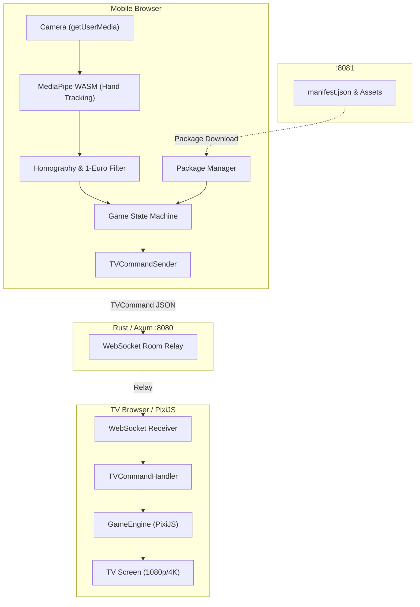

# AirCanvas Kids 아키텍처 가이드 (v0.2)

AirCanvas Kids는 **Phone=Brain / TV=Thin Display** 모델을 기반으로 동작하는 인터랙티브 에어 드로잉 & 컬러링 패밀리 게임 시스템입니다.

## 1. 핵심 아키텍처 원칙

1. **Phone = Game Brain (지능 및 상태 관리)**
   - 게임 상태 머신(`gameStateMachine.ts`): 로비(Lobby) → 연결(Connecting) → 캘리브레이션(Calibrating) → 플레이(Playing) → 갤러리(Gallery) 전이 관리.
   - MediaPipe Tasks Vision WASM을 통한 온디바이스 손 추적 및 핀치(Pinch) 제스처 인식.
   - 4-코너 호모그래피(Homography) 좌표 변환 및 One-Euro Filter 지터 보정.
   - 콘텐츠 서버에서 게임 패키지 매니페스트(`manifest.json`) 다운로드 및 IndexedDB/localStorage 캐싱.
   - 로컬 네트워크 내 TV 디스커버리 및 TV로 단방향 렌더 명령(`TVCommand`) 발행.

2. **TV = Thin Display (씬 렌더러)**
   - 순수 렌더러 역할: 내부 상태 머신을 갖지 않는 Stateless 구조.
   - React + PixiJS 기반 씬 렌더링 엔진(`GameEngine.ts`).
   - 수신된 `TVCommand`(`load-scene`, `set-cursor`, `draw-stroke`, `fill-region`, `play-effect`, `set-progress`)를 즉시 그래픽스로 변환 실행.
   - 콘텐츠 확장에 따른 TV 클라이언트 코드 수정 불필요(콘텐츠 독립성).

3. **Server = Relay Hub (경량 세션 중계)**
   - Rust/Axum + tokio-tungstenite 기반 고성능 WebSocket 릴레이.
   - 6자리 영숫자 방 코드(`roomCode`) 기반 1:1 (또는 1:N) 피어 매칭.
   - 영상 스트림 전송 배제: 순수 좌표 JSON 및 제어 커맨드만 중계하여 지연 시간 최소화 및 로컬 폐쇄망 보안 준수.

4. **Content Server = Asset & Manifest Hub**
   - Nginx 정적 서빙(기본 포트 8081).
   - 게임 패키지 매니페스트(`manifest.json`) 및 SVG 썸네일/에셋 배포.

---

## 2. 모노레포 구조 및 패키지 책임

```text
aircanvas-kids/
├── apps/
│   ├── phone/          # 모바일 웹 앱 (Brain, Camera, Tracking, State Machine)
│   └── tv/             # 스마트 TV 웹 앱 (Thin Display, PixiJS Scene Renderer)
├── packages/
│   ├── protocol/       # TypeScript 프로토콜 타입 단일 진실원 (SSOT)
│   └── tv-art/         # SVG 파싱 및 30종 기본 아트워크 정의 라이브러리
├── server/             # Rust/Axum WebSocket 릴레이 서버
├── content-server/     # Nginx 정적 에셋 및 매니페스트 배포 서버
├── docs/               # 아키텍처, 프로토콜, 캘리브레이션 설계 문서
└── agents/             # 에이전트 규칙, 세션 상태, 스킬 가이드
```

---

## 3. 데이터 흐름 다이어그램



---

## 4. 개발 및 수정 시 점검 체크리스트

- [ ] **영상 전송 금지 원칙 준수**: 카메라 영상/프레임은 모바일 기기 외부로 절대 유출/전송하지 않는다.
- [ ] **프로토콜 일치**: `packages/protocol` 타입 수정 시 `server/src/main.rs` 및 `docs/protocol.md`와 동기화.
- [ ] **Stateless TV**: TV 앱 내부에 독자적인 비즈니스 룰이나 씬 전환 결정을 두지 않고 Phone의 `TVCommand`에 의해서만 전환.
- [ ] **빌드 검증**: `npm run build` (phone, tv, protocol, tv-art) 및 `cargo check` 통과.
