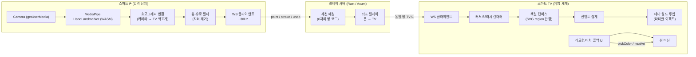

# AirCanvas Kids — 시스템 아키텍처

## 1. 개요

AirCanvas Kids는 **스마트폰 카메라 1대 + 스마트 TV 1대 + Wi-Fi LAN** 만으로 동작하는
공중 제스처 드로잉/색칠 게임이다.

- 스마트폰: 카메라 영상에서 **아이 손(검지 끝) 좌표만 추출** → 서버로 전송 (영상 전송 없음)
- 서버(Rust/Axum): 폰↔TV 세션 매칭 및 좌표 릴레이 (저지연 단순 브로커)
- TV(React + PixiJS): 캔버스 렌더링, 색칠 진행도 판정, 테마 월드/이펙트 연출

핵심 원칙: **카메라 → 좌표 추출 → 좌표만 전송 → TV 렌더링.** 영상 프레임은 어디에도 전송되지 않으므로
네트워크 부하가 극히 낮고(초당 수 KB), 지연은 LAN 기준 수십 ms 이내이다.



## 2. 구성 요소

| 구성요소 | 기술 | 책임 |
|---|---|---|
| `apps/phone` | React + Vite + MediaPipe Tasks Vision | 카메라 제어, 손 랜드마크 추적, 캘리브레이션, 좌표 전송 |
| `apps/tv` | React + Vite + PixiJS 8 | 게임 씬, 그리기/색칠, 진행도 판정, 월드 이펙트 |
| `server/` | Rust + Axum + tokio-tungstenite | 방 코드 세션 매칭, 좌표 릴레이, 헬스체크 |
| `packages/protocol` | TypeScript | 폰/TV/서버가 공유하는 메시지 스키마 단일 진실원 |

## 3. 데이터 흐름 (프레임별)

1. **연결:** TV가 홈 화면에 QR 표시 → 폰이 스캔하면 `?server=&room=` 파라미터로 자동 입장(수동 코드 입력 폴백).
2. **게임 시작:** **테마/작품 선택은 폰에서 진행** — 폰이 `select-theme` / `select-artwork` 메시지를 보내면
   TV가 해당 테마 월드와 아트워크를 로드한다.
3. **캘리브레이션:** TV 화면의 4코너 마커를 폰 카메라로 측정해 호모그래피 H 계산(`docs/calibration.md`).
4. **추적:** 폰 카메라 30fps → MediaPipe가 21개 손 랜드마크 반환 → 검지 끝(LANDMARK #8) 사용.
5. **변환:** 이미지 픽셀 좌표 → 정규화(0..1) → H 적용 → **TV 좌표계(0..1)**.
6. **스무딩:** One-Euro 필터로 지터 제거 후 ~30Hz로 `point` 메시지 전송.
7. **릴레이:** 서버는 방(room)에 접속한 TV로 메시지를 그대로 전달.
8. **렌더:** TV는 커서 표시 + 드로잉 모드에서는 경로를 선으로 연결, 색칠 모드에서는
   SVG region hit-test로 해당 영역을 채움.
9. **판정:** 각 아트워크의 region 면적 비율로 색칠 진행도 집계 → 85% 근접 시 완성 이벤트.
10. **연출:** 완성 그림이 파티클 버스트와 함께 해당 테마 월드(갤러리 씬)에 배치됨.

## 4. 좌표계 및 캘리브레이션

TV 화면에 4개 코너 마커를 순차 표시하고, 폰 카메라로 각 마커의 화면상 위치를 측정하여
3×3 호모그래피 행렬 H를 계산한다(상세: `docs/calibration.md`). 폰이 TV 정면이 아니라
살짝 비스듬히 놓여도 원근 보정이 가능하다. H는 폰 로컬 저장소에 보관하여 재실시하지 않아도 된다.

## 5. 네트워크 토폴로지

```
[Phone] ──ws://server:8080/ws?role=phone&room=ABC123──┐
                                                       │  Rust Relay
[TV]    ──ws://server:8080/ws?role=tv&room=ABC123─────┘
```

- 서버는 상태를 거의 갖지 않는 stateless 릴레이(방 코드 → 소켓 맵)이다.
- 같은 LAN에서만 동작하며 외부 인터넷 노출 없음(제로 트러스트: 폐쇄망 가정).
- 좌표 메시지 크기 ≈ 60~90 bytes, 30Hz 기준 ≈ 2~3 KB/s per client — 영상 스트리밍 대비 4자리수 낮은 트래픽.

### 폰 온보딩 (QR)

TV 홈 화면이 폰 앱 URL에 `?server=<릴레이 주소>&room=<방코드>`를 담은 QR을 렌더링한다
(`phoneJoinUrl()` — `packages/protocol`). 폰 앱은 두 파라미터를 읽어 자동 입장하므로,
가족 누구나 QR 스캔 한 번으로 세션에 합류한다. 수동 방 코드 입력은 폴백으로 유지된다.

## 6. 보안·프라이버시

- 카메라 영상은 브라우저 내부에서만 처리되며 **절대 업로드되지 않는다.**
- 서버는 좌표 외 어떤 미디어도 취급하지 않는다.
- 방 코드(6자리)로 세션을 격리해 가족 단위 안전 매칭을 보장.

## 7. 확장 로드맵 요약

MVP(그리기+색칠+월드 투입) 이후 계획은 `docs/roadmap.md` 참조:
모양 인식(물고기/공룡 판정), 펜 물체 추적, 다인 동시 입장, 사운드, PWA 오프라인 등.
