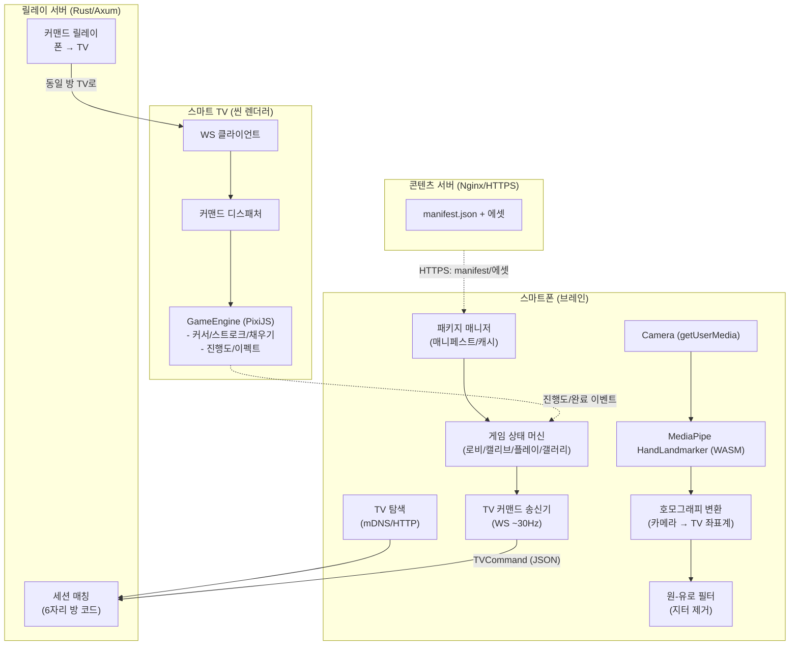
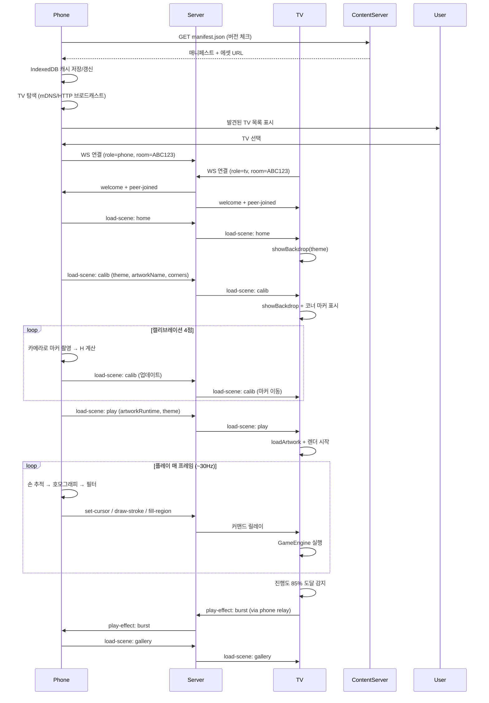

# AirCanvas Kids — 시스템 아키텍처 v0.2

## 1. 개요

AirCanvas Kids는 **스마트폰 카메라 1대 + 스마트 TV 1대 + Wi-Fi LAN** 만으로 동작하는
공중 제스처 드로잉/색칠 게임이다.

### 핵심 원칙 (변경 없음)
- **카메라 영상은 어디로도 전송되지 않는다.** 폰에서 좌표만 추출 → 서버 릴레이 → TV 렌더링
- 네트워크 부하 극히 낮음(초당 수 KB), 지연은 LAN 기준 수십 ms 이내

### 아키텍처 진화: Phone = Brain, TV = Thin Display

```
┌─────────────────────────────────────────────────────────────────┐
│  콘텐츠 서버 (Nginx + 정적 파일)                                   │
│  - 게임/테마 패키지 버전관리 (manifest.json + 에셋 CDN)            │
│  - 폰이 주기적 폴링으로 업데이트 체크                               │
└────────────────────────────┬──────────────────────────────────────┘
                             │ HTTPS (인터넷)
                             ▼
┌─────────────────────────────────────────────────────────────────┐
│  폰 (브레인)                                                      │
│  - 패키지 캐시 (IndexedDB)                                        │
│  - 게임 상태 머신 (로비/캘리브/플레이/갤러리)                      │
│  - 손 추적 + 호모그래피 + One-Euro 필터                           │
│  - TV 탐색 (mDNS/HTTP 브로드캐스트)                               │
│  - TV로 렌더 커맨드 전송 (WS)                                     │
└────────────────────────────┬──────────────────────────────────────┘
                             │ 로컬 WS (초저지연, ~30Hz)
                             ▼
┌─────────────────────────────────────────────────────────────────┐
│  TV (씬 렌더러)                                                  │
│  - PixiJS 렌더 엔진만 보유                                        │
│  - 폰에서 오는 커맨드 실행:                                       │
│    loadScene(sceneId, payload)                                   │
│    drawStroke(points, color)                                     │
│    fillRegion(regionId, color)                                   │
│    playEffect(effectType, params)                                │
│  - 상태 없음 (Stateless)                                         │
└─────────────────────────────────────────────────────────────────┘
```

## 2. 구성 요소

| 구성요소 | 기술 | 책임 |
|---|---|---|
| `apps/phone` | React + Vite + MediaPipe Tasks Vision | 카메라 제어, 손 랜드마크 추적, 캘리브레이션, 게임 상태 머신, 패키지 관리, TV 탐색, 렌더 커맨드 송신 |
| `apps/tv` | React + Vite + PixiJS 8 | 렌더 커맨드 수신/실행, GameEngine을 통한 그리기/색칠/이펙트 렌더링 |
| `server/` | Rust + Axum + tokio-tungstenite | 방 코드 세션 매칭, 좌표/커맨드 릴레이, 헬스체크 |
| `packages/protocol` | TypeScript | 폰/TV/서버/콘텐츠서버가 공유하는 메시지 스키마 단일 진실원 |
| `packages/tv-art` | TypeScript | 아트워크 30종 데이터 (공룡·정글·바다 × 10) |
| `content-server/` | Nginx + 정적 파일 | 게임 패키지 매니페스트/에셋 서빙 (HTTPS) |

## 3. 데이터 흐름 (프레임별)

1. **초기화**: 폰 앱 실행 → 콘텐츠 서버에서 `manifest.json` 다운로드 → IndexedDB 캐시
2. **TV 탐색**: 폰이 LAN 브로드캐스트/mDNS로 TV 자동 발견 → 사용자가 TV 선택
3. **연결**: 선택된 TV의 WS URL로 접속 → 서버 릴레이로 폰↔TV 세션 성립
4. **로비**: 폰이 `load-scene: home` 전송 → TV 홈 화면 표시 (방 코드 QR 표시)
5. **게임 시작**: **테마/작품 선택은 폰에서 진행** → 폰이 `load-scene: calib` + 페이로드 전송
6. **캘리브레이션**: TV 화면의 4코너 마커를 폰 카메라로 측정 → 호모그래피 H 계산 → 저장
7. **플레이**: 폰이 `load-scene: play` + 아트워크 데이터 전송 → TV 렌더링 시작
8. **추적**: 폰 카메라 30fps → MediaPipe 손 랜드마크 → 검지 끝 → 정규화 → H 적용 → One-Euro 필터
9. **커맨드 전송**: 폰이 매 프레임 `set-cursor`, 스트로크 시 `draw-stroke`, 탭 시 `fill-region` 전송
10. **릴레이**: 서버는 방(room)에 접속한 TV로 메시지를 그대로 전달
11. **렌더**: TV는 커서 표시 + `draw-stroke`로 경로 연결, `fill-region`으로 영역 채움
12. **판정**: TV가 진행도 집계 → 85% 도달 시 `play-effect: burst` → `load-scene: gallery`
13. **연출**: 완성 그림이 파티클 버스트와 함께 해당 테마 월드(갤러리 씬)에 배치됨

## 4. 좌표계 및 캘리브레이션

TV 화면에 4개 코너 마커를 순차 표시하고, 폰 카메라로 각 마커의 화면상 위치를 측정하여
3×3 호모그래피 행렬 H를 계산한다(상세: `docs/calibration.md`). 폰이 TV 정면이 아니라
살짝 비스듬히 놓여도 원근 보정이 가능하다. H는 폰 로컬 저장소에 보관하여 재실시하지 않아도 된다.

## 5. 네트워크 토폴로지

```
[Phone] ──ws://server:7180/ws?role=phone&room=ABC123──┐
                                                       │  Rust Relay
[TV]    ──ws://server:7180/ws?role=tv&room=ABC123─────┘
```

- 서버는 상태를 거의 갖지 않는 stateless 릴레이(방 코드 → 소켓 맵)이다.
- 같은 LAN에서만 동작하며 외부 인터넷 노출 없음(제로 트러스트: 폐쇄망 가정).
- 좌표/커맨드 메시지 크기 ≈ 100~300 bytes, 30Hz 기준 ≈ 3~9 KB/s per client — 영상 스트리밍 대비 4자리수 낮은 트래픽.

### 폰 온보딩 (QR + 자동 탐색)

TV 홈 화면이 폰 앱 URL에 `?server=<릴레이 주소>&room=<방코드>`를 담은 QR을 렌더링한다
(`phoneJoinUrl()` — `packages/protocol`). 폰 앱은 두 파라미터를 읽어 자동 입장하므로,
가족 누구나 QR 스캔 한 번으로 세션에 합류한다. **추가로 폰에서 "TV 자동 찾기"로 탐색 가능.**

## 6. 콘텐츠 파이프라인

- 콘텐츠 서버(Nginx)가 `manifest.json` + 썸네일/데이터 에셋을 정적 파일로 서빙
- 폰이 시작 시 매니페스트 버전 체크 → 변경 시 증분 다운로드 → IndexedDB 캐시
- 신규 게임/테마 추가는 콘텐츠 서버에 파일 올리기만 하면 폰이 자동 수신, **TV 코드 수정 불필요**
- 버전별 롤아웃, A/B 테스트, 강제 업데이트 가능

## 7. 보안·프라이버시

- 카메라 영상은 브라우저 내부에서만 처리되며 **절대 업로드되지 않는다.**
- 서버는 좌표/커맨드 외 어떤 미디어도 취급하지 않는다.
- 방 코드(6자리)로 세션을 격리해 가족 단위 안전 매칭을 보장.
- 콘텐츠 서버 통신도 HTTPS(인증서) 권장.

## 8. 확장 로드맵 요약

MVP(그리기+색칠+월드 투입) 이후 계획은 `docs/roadmap.md` 참조:
모양 인식, 펜 물체 추적, 다인 동시 입장, 사운드, PWA 오프라인 등.

---

## Mermaid 시스템 다이어그램



---

## Mermaid 시퀀스 다이어그램 (게임 시작~플레이)

