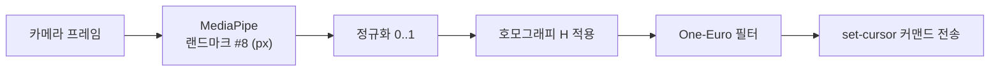

# 캘리브레이션 가이드 v0.2 — 4코너 호모그래피

## 1. 왜 필요한가

폰 카메라 좌표계와 TV 화면 좌표계는 서로 다른 평면이다. 폰을 TV 정면에 두지 않고
살짝 옆에 놓는 경우(일반적) 카메라가 보는 사각형은 **원근 왜곡**된 사각형이다.
두 평면 사이의 대응 관계는 3×3 호모그래피 행렬 `H` 하나로 표현된다.

```
[ x' ]   [ h11 h12 h13 ] [ x ]
[ y' ] = [ h21 h22 h23 ] [ y ]
[ 1  ]   [ h31 h32 h33 ] [ 1 ]
```

- `(x, y)`: 카메라 이미지 정규화 좌표(0..1)
- `(x', y')`: TV 정규화 좌표(0..1)

4개의 점 대응만으로 H를 정확히 계산할 수 있다(자유도 8, 각 점이 2개 제약).

## 2. 절차 (UX 플로우) — v0.2 Phone=Brain

1. **폰에서 작품 선택** → 폰이 `load-scene: calib` 전송
   ```json
   {
     "type": "load-scene",
     "scene": "calib",
     "payload": {
       "scene": "calib",
       "theme": "dino",
       "artworkName": "티라노사우루스",
       "corners": [
         { "x": 0.08, "y": 0.08 },
         { "x": 0.92, "y": 0.08 },
         { "x": 0.92, "y": 0.92 },
         { "x": 0.08, "y": 0.92 }
       ]
     }
   }
   ```

2. **TV 수신** → `TVCommandHandler.handleLoadCalib()` → `GameEngine.showBackdrop(theme)` + 4코너 마커 순차 표시
   - ① 좌상단(0.08, 0.08) → ② 우상단(0.92, 0.08) → ③ 우하단(0.92, 0.92) → ④ 좌하단(0.08, 0.92)
   - 각 마커는 흰 원 + 검정 링, 폰 사용자가 해당 코너를 카메라 십자에 맞출 때까지 표시

3. **폰 캘리브레이션 화면** (`CalibViewfinder`):
   - 카메라 프리뷰 + 중앙 십자(조준심) 표시
   - TV 화면의 현재 마커(1/4, 2/4, 3/4, 4/4)를 십자에 맞춤
   - "이 점 캡처" 버튼 눌러 카메라 좌표 샘플링

4. **4점 수집 완료** → 폰에서 DLT로 H 계산 → **재투영 오차** 계산해 품질 판정
   - 평균 오차 < 1.5%: 통과(녹색), 1.5~3%: 주의(노랑), > 3%: 재시도 권장(빨강)

5. **결과 저장**: `localStorage["ht.calibration.v1"]` 에 `{ corners[], matrix[], errorPct, savedAt }`

6. **플레이 전환**: 폰이 `load-scene: play` + `ArtworkRuntime` 전송 → TV 렌더링 시작

7. **이후 세션**: 저장된 H 자동 로드 (`App.tsx` 마운트 시 `loadCalibration()` 호출), 폰 위치를 옮겼다면 "다시 캘리브레이션" 버튼으로 재실행

## 3. 실전 배치 팁

| 항목 | 권장값 | 이유 |
|---|---|---|
| 폰 위치 | TV 하단 스탠드 앞 또는 측면 30° 이내 | 원근 왜곡 최소화 |
| 거리 | TV 폭의 1.5~2배 | 아이 손 영역 전체가 프레임 안 |
| 카메라 높이 | 아이 손 높이와 비슷하게 | 손이 카메라 시야 밖으로 나가지 않도록 |
| 조명 | 마커·손에 역광 금지 | MediaPipe 손 인식률 저하 방지 |
| 그리기 영역 | TV 기준 중앙 84% (0.08~0.92) | 마커와 겹치지 않는 안전 마진 |

## 4. 좌표 변환 파이프라인 (폰 내부)



호모그래피 적용 코드는 `apps/phone/src/lib/homography.ts`의 `applyHomography()` 참조.

## 5. 자동 캘리브레이션 (M3 예정)

현재는 사용자가 "이 점 캡처" 버튼을 눌러 수동 샘플링함(MVP). M3에서 개선 예정:

- **ArUco 마커** (OpenCV.js) 또는 **AprilTag** 를 TV 코너에 표시
- 폰이 카메라 프레임에서 마커 자동 검출 → 코너 좌표 자동 추출
- 사용자 개입 없이 4점 자동 수집 → H 계산 → 품질 검증
- 실패 시에만 수동 모드 폴백

## 6. 품질 체크리스트

- [ ] 4코너 모두 재시도 없이 한 번에 잡혔는가
- [ ] 재투영 평균 오차 < 1.5%인가
- [ ] 커서를 TV 4코너 근방으로 움직였을 때 화면 커서가 마커 위치에 도달하는가
- [ ] 손을 빠르게 움직여도 커서가 지터 없이 따라오는가(One-Euro 동작 확인)
- [ ] 캘리브레이션 저장 후 앱 재시작 시 H 자동 로드되는가
- [ ] "다시 캘리브레이션" 버튼으로 재실행 시 정상 동작하는가