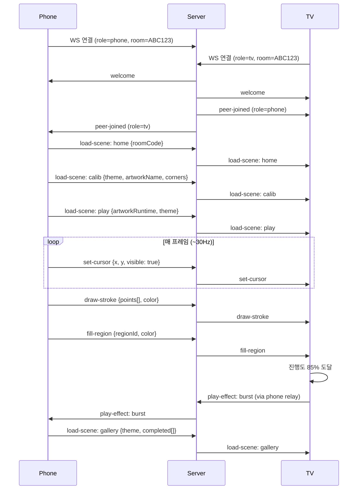

# 통신 프로토콜 명세 v0.2

단일 WebSocket 엔드포인트에서 JSON 텍스트 프레임으로 통신한다.
스키마의 단일 진실원은 `packages/protocol/src/index.ts` 이며, 서버 Rust 구현은 이 문서와 동기화를 유지한다.

## 1. 연결

```
ws://<server>:8080/ws?role=tv&room=ABC123
ws://<server>:8080/ws?role=phone&room=ABC123
```

- `room`: 6자리 대문자 영숫자. TV가 생성하고 폰이 입력한다.
- 한 room 에 `tv`는 최대 1대, `phone`은 최대 4대까지 허용(v0.2은 1대 사용).
- 첫 메시지로 서버→클라이언트 `welcome`, 두 번째 클라이언트 접속 시 상대에게 `peer-joined` 전송.

## 2. 메시지 공통 형태

모든 메시지는 `type` 필드를 갖는다.

```ts
interface BaseMessage { type: string }
```

## 3. 레거시 메시지 (v0.1 호환용)

### `hello-tv` (TV → 서버)
```json
{ "type": "hello-tv", "displayName": "Living Room TV", "screen": { "w": 1920, "h": 1080 } }
```

### `hello-phone` (폰 → 서버)
```json
{ "type": "hello-phone", "displayName": "Dad's Phone" }
```

### `point` (폰 → 서버 → TV, 약 30Hz)
```json
{ "type": "point", "x": 0.512, "y": 0.337, "pinch": false, "t": 1724448000000 }
```
- `x,y`: **TV 좌표계 정규화 값(0..1)** — 캘리브레이션 호모그래피 적용 후 값.
- `pinch`: 엄지-검지 핀치 여부.
- `t`: 폰 기준 타임스탬프(ms).

### `stroke-start` / `stroke-end`
```json
{ "type": "stroke-start", "color": "#e63946" }
{ "type": "stroke-end" }
```

### `fill`
```json
{ "type": "fill", "x": 0.42, "y": 0.61, "color": "#457b9d" }
```

### `undo`
```json
{ "type": "undo" }
```

### `select-theme` / `select-artwork`
```json
{ "type": "select-theme", "theme": "dino" }
{ "type": "select-artwork", "theme": "ocean", "index": 3 }
```

## 4. v0.2: Phone=Brain / TV=Thin Display 프로토콜

### 4.1 TVCommand (폰 → TV 단방향, 서버 경유)

폰이 게임 상태 머신을 운영하며 TV로 렌더 커맨드를 내린다.

```ts
type TVCommand =
  | { type: 'load-scene'; scene: 'home' | 'calib' | 'play' | 'gallery'; payload: LoadScenePayload }
  | { type: 'set-cursor'; x: number; y: number; visible: boolean; color?: string }
  /** 자유선 그리기: 점 배열로 경로 전송 */
  | { type: 'draw-stroke'; points: { x: number; y: number }[]; color: string }
  /** 영역 채우기: regionId로 식별 */
  | { type: 'fill-region'; regionId: string; color: string }
  /** 좌표 기반 영역 채우기: TV 화면 정규화 좌표(0..1) 히트테스트 */
  | { type: 'fill-at'; x: number; y: number; color: string }
  /** 이펙트 재생 */
  | { type: 'play-effect'; effect: 'burst' | 'confetti' | 'pulse'; params: Record<string, any> }
  | { type: 'set-progress'; percent: number; artworkName?: string }
  | { type: 'undo' }
  | { type: 'reset-canvas' }
  | { type: 'debug'; action: 'ping' | 'stats'; data?: any };
```

#### `load-scene` 페이로드

```ts
type LoadScenePayload =
  | { scene: 'home'; roomCode: string; tvName?: string }
  | { scene: 'calib'; theme: ThemeId; artworkName: string; corners: { x: number; y: number }[] }
  | { scene: 'play'; artwork: ArtworkRuntime; theme: ThemeId }
  | { scene: 'gallery'; theme: ThemeId; completed: CompletedArtwork[] };
```

#### `ArtworkRuntime` (TV 전송용 경량 아트워크)
```ts
interface ArtworkRuntime {
  id: string;
  name: string;
  viewBox: string;
  regions: RegionRuntime[];
}

interface RegionRuntime {
  id: string;
  label: string;
  path: string; // SVG path 데이터
}
```

#### `CompletedArtwork`
```ts
interface CompletedArtwork {
  id: string;
  name: string;
  thumbnailDataUrl: string; // base64 PNG
  completedAt: number;
  progress: number;
}
```

### 4.2 서버 → 클라이언트 (제어)

#### `welcome`
```json
{ "type": "welcome", "room": "ABC123", "role": "tv", "peers": ["phone"] }
```

#### `peer-joined`
```json
{ "type": "peer-joined", "role": "phone", "displayName": "Dad's Phone" }
```

#### `peer-left`
```json
{ "type": "peer-left", "role": "phone" }
```

#### `error`
```json
{ "type": "error", "code": "ROOM_NOT_FOUND", "message": "..." }
```
에러 코드: `ROOM_NOT_FOUND`, `ROOM_FULL`, `ROLE_CONFLICT`, `BAD_REQUEST`.

## 5. 콘텐츠 서버 API (폰 ↔ 콘텐츠 서버)

### `GET /manifest.json`
게임 패키지 매니페스트 반환.

```ts
interface GamePackageManifest {
  id: string;           // 'aircanvas-kids'
  version: string;      // semver
  title: string;
  description: string;
  entryScene: 'home';
  themes: ThemePack[];
  minProtocolVersion: string; // '0.2.0'
  assetsBaseUrl: string;      // CDN 베이스 URL
}
```

### `GET /artworks/thumbnails/{artworkId}.svg`
아트워크 썸네일 이미지 (SVG).

### `GET /health`
헬스체크 엔드포인트.

## 6. TV 디스커버리 (폰 ↔ TV 로컬 네트워크)

### TV 발표 (`GET /announce` 또는 브로드캐스트)
```ts
interface TVAnnouncement {
  type: 'tv-announce';
  roomCode: string;
  tvName: string;
  tvId: string;
  wsUrl: string;
  httpUrl: string;
  capabilities: TVCapabilities;
  timestamp: number;
}

interface TVCapabilities {
  maxResolution: { width: number; height: number };
  supportsWebGL2: boolean;
  supportsWASMSIMD: boolean;
  pixiVersion: string;
}
```

## 7. 트래픽 예산

| 메시지 | 빈도 | 크기(대략) | 대역폭 |
|---|---|---|---|
| point (레거시) | 30/s | ~80B | ~2.4KB/s |
| set-cursor | 30/s | ~120B | ~3.6KB/s |
| draw-stroke | 이벤트성 | ~500B | 무시 가능 |
| fill-region | 이벤트성 | ~200B | 무시 가능 |
| load-scene | 세션당 수회 | ~2-5KB | 무시 가능 |

영상 스트리밍(720p H.264 ≈ 1~3Mbps) 대비 **1/1000 수준**이다.

## 8. 시퀀스 예시: 게임 시작~플레이

